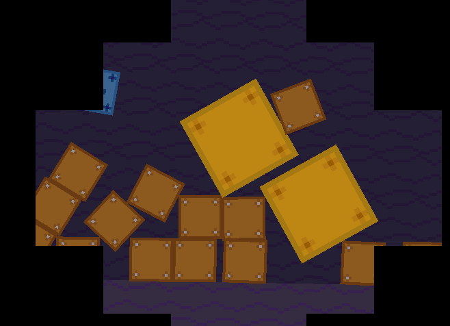

# wiidestroyboxes
Wiidestroyboxes is my DofE project that will run on the Wii and dolphin emulator.
The game will be about destroying boxes in a short amount of time by using with the Wii remotes.

# The old version of the game (Made in Godot)
Video of the original game https://youtu.be/pmGe6ucNaJg?si=PcnJ8TSHByOLCiZ3

# At the start there was only one box.

# Then there was a lot!

# Then I got it runing on dolphin.

# On dolphin with GRRLIB for the graphics.

# Hiting boxes.

# Some more time later...

